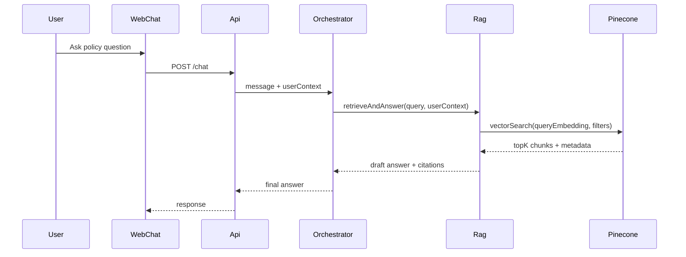
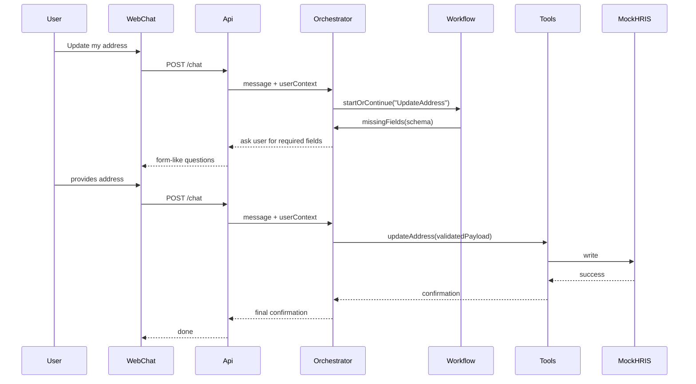

## Goals (Phase 1)

- Answer **policy questions** via RAG over HR knowledge (policies, handbooks, benefit docs)
- Handle **routine requests** via tool calls (initially through a **mock HRIS** + mock downstream providers)
- **Route complex workflows** to the right approver/queue (initially as tasks/tickets)
- Keep the solution **channel-agnostic** so Slack/Teams can be added later with minimal change

## High-level architecture

- **Client**: simple web chat UI (or CLI) used for internal testing
- **API Gateway**: single entrypoint (`/chat`, `/events`, `/admin/ingest`)
- **Conversation Orchestrator** (LLM “agent”): routes user messages to one of
  - PolicyRAGAnswer
  - PersonalDataLookup (e.g., leave balance)
  - RequestProcessing (e.g., update address)
  - WorkflowRouting (approvals, escalations)
- **RAG Service**: retrieval + prompt assembly + citations
- **Tool/Action Service**: executes validated actions (HRIS, benefits provider, ticketing) through a uniform interface
- **Workflow Engine**: state machine for multi-turn forms + approvals + retries
- **Stores**:
  - **Pinecone**: vector index of policy/knowledge chunks
  - **Relational DB** (Postgres/SQLite initially): conversations, workflow state, user profiles (minimal), approvals, idempotency keys
  - **Object storage** (local/S3 later): raw documents, ingestion artifacts
  - **Audit log** (append-only table): every tool call, inputs/outputs, actor, timestamps
- **Observability**: metrics + structured logs + traces + evaluation dataset

## Core data flows

### 1) Policy Q&A (RAG)

### 2) Request processing (tool calls + workflow)

## Key design decisions (recommended)

- **Channel-agnostic contract**: define an internal message schema (`userId`, `text`, `locale`, `timezone`, `employeeAttributes`, `attachments`) so Slack/Teams later only map in/out.
- **Router first, then specialist handlers**:
  - Router: lightweight LLM classification with a strict set of routes and confidence thresholds.
  - Handlers: separate prompts/logic per route to reduce hallucination and make testing easier.
- **How to explain it to judges (two-lane retrieval)**:
  - **Lane 1: Enterprise knowledge (RAG)**: “We ingest HR policies/handbooks into Pinecone, chunked and tagged with metadata (region, employee type, effective date). The assistant retrieves the most relevant clauses and answers with citations.”
  - **Lane 2: System-of-record facts (HRIS tools)**: “For anything that must be current and personalized (leave balance, employment dates, manager), we never rely on embeddings. We call the HRIS API at request time and display the returned values.”
  - **Why it’s correct**: “Policies change slowly and need citations → RAG is ideal. Balances change daily and are per-employee → live API calls are required.”
- **RAG with governance**:
  - Chunk docs with stable IDs; store metadata (`docType`, `effectiveDate`, `region`, `employeeType`, `confidentiality`).
  - Apply **metadata filters** based on user attributes to avoid leaking content.
  - Always return **citations** (doc name + section + effective date).
- **Tool execution is deterministic**:
  - LLM proposes tool calls, but **server validates** schema, permissions, and idempotency.
  - Writes require **explicit confirmation** step for safety (even in web chat).
- **Workflow engine for multi-step tasks**:
  - Model routine changes as state machines with required fields, validation rules, and completion criteria.
  - Example workflows: UpdateAddress, AddDependent, ExpenseEligibilityCheck.
- **Mock HRIS first** (your choice):
  - Implement HRIS interface with a mock backend now; swap in real HRIS connector later without changing orchestration.

## Components in more detail

### A) Knowledge ingestion pipeline (policies → Pinecone)

- **Inputs**: PDFs, Confluence/Notion exports, HR policy docs
- **Steps**:
  - Convert to text + structure (headings, sections)
  - Chunking strategy: section-aware, 300–800 tokens, overlap 10–15%
  - Enrichment: doc title, section path, effective date, region, owner, last review
  - Embed chunks and upsert into Pinecone (namespace per environment)
  - Store raw doc + parsed text for traceability

### B) Retrieval and answer generation

- Query rewriting (optional) + embedding
- Pinecone topK retrieval (hybrid BM25 optional later)
- Rerank (optional)
- Answer prompt includes: user question, retrieved chunks, response policy (cite sources, do not invent)
- Output: answer + citations + “next best action” suggestions when appropriate

### C) Tool layer (read/write operations)

- **Read tools** (safe): getLeaveBalance, getEmployeeProfile
- **Write tools** (guarded): updateAddress, addDependent
- Policies:
  - Permission checks by role
  - Confirm-before-write
  - Rate limits
  - Idempotency keys
  - Full audit log

### D) Workflow routing (approvals)

- For requests requiring approvals (e.g., exceptions, promotions, non-standard expenses):
  - Determine route using policy + org rules (manager, HRBP, finance)
  - Create an approval task (Phase 1: store in DB + email/notification; Phase 2: Slack/Teams adaptive card)
  - Track state: pending → approved/denied → executed/closed

## Minimal Phase 1 deliverable (no Slack/Teams)

- Web chat UI + backend API
- Pinecone-backed RAG for policy Q&A with citations
- Mock HRIS connector implementing:
  - leave balance lookup
  - address update
  - dependent add
- Workflow engine for multi-turn data collection + confirmation + audit logs
- Admin ingestion endpoint/job to load docs into Pinecone

## Phase 2/3 extension points

- Add Slack bot and/or Teams bot as adapters to the same `/chat` API
- Replace mock HRIS connector with real connector (Workday/BambooHR/etc.)
- Add ticketing/ITSM integration (Jira/ServiceNow)
- Add SSO (Okta/Azure AD), fine-grained ABAC, and DLP controls

## Testing and evaluation

- Curate a small eval set:
  - Policy Qs with expected citations
  - Tool flows (happy + validation errors)
  - Permission boundaries
- Track: answer groundedness, citation correctness, tool success rate, time-to-resolution

